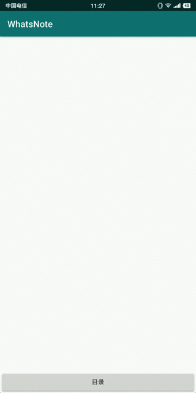

# WhatsNote多层目录实现

## 一、实现效果




## 二、关键代码

1. `FileDataset & FileEntity`

目录及笔记的抽象基类，定义了二者的共同属性。

```Java
public class FileDataset<T extends FileDataset.FileEntity> extends BaseDataset<T> {

    public static abstract class FileEntity extends BaseEntity {

        @SerializedName("name")
        String name; // real name from user

        @SerializedName("desc")
        String desc; // entity description

        @SerializedName("alias")
        private String alias; // inner use, alias from app, name first
}
```

2. `FolderDataset & FolderEntity`

目录

```java
public class FolderDataset extends FileDataset<FolderDataset.FolderEntity> {

    public static class FolderEntity extends FileDataset.FileEntity {

        public FolderEntity(String id) {
            super(id);
        }

        @Override
        public boolean isDirectory() {
            return true;
        }

    }
}
```

3. `NoteDataset & NoteEntity`

笔记

```java
public class NoteDataset extends FileDataset<NoteDataset.NoteEntity> {

    public static class NoteEntity extends FileDataset.FileEntity {

        public NoteEntity(String id) {
            super(id);
        }

        @Override
        public boolean isDirectory() {
            return false;
        }

    }
}
```

4. `RecordDataset & RecordEntity`

记录，用于保存目录和笔记的层次关系。

```java
public class RecordDataset extends BaseDataset<RecordDataset.RecordEntity> {

    static final int TYPE_FOLDER = 0x01;
    static final int TYPE_NOTE   = 0x02;

    private static final String KEY_FOLDER  = "folder";
    private static final String KEY_NOTE    = "note";

    public List<RecordEntity> getChildren(String parent, List<RecordEntity> list) {
        list = (list == null)? new ArrayList<RecordEntity>(): list;
        list.clear();

        for (RecordEntity e: this.list) {
            if (e.getParent().equalsIgnoreCase(parent)) {
                list.add(e);
            }
        }

        return list;
    }

    public static class RecordEntity extends BaseEntity {

        @SerializedName("parent")
        String parent;

        @SerializedName("type")
        String type;

        private int typeValue; // I prefer to save string value and use int value. :)

}
```

5. `NoteManager`

笔记管理者，通过`NoteManager`获取到`FolderEntity`和`NoteEntity`的所有数据。

* 核心属性

```java
public static final int TYPE_FOLDER = RecordDataset.TYPE_FOLDER;
public static final int TYPE_NOTE   = RecordDataset.TYPE_NOTE;
public static final int TYPE_ALL    = TYPE_FOLDER | TYPE_NOTE;

RecordDataset recordDs; // 记录集合
SparseArray<FileDataset<? extends FileDataset.FileEntity>> noteDsArray; // folder and note dataset

List<RecordDataset.RecordEntity> recordList;
List<FileDataset.FileEntity> fileList;

static NoteManager instance;

```

* 核心方法

  1. 获取目录及笔记

  ```java
  public List<FileDataset.FileEntity> getList(String parent, int type, List<FileDataset.FileEntity> list)
  ```


  2. 创建目录及笔记

  ```java
  public FileDataset.FileEntity create(String parent, int type)
  ```


  3. 获取名称

  对`name`添加序号后缀生成唯一的名称。

  ```java
  public String getName(@NonNull FileDataset.FileEntity entity, @NonNull  String name)
  ```


