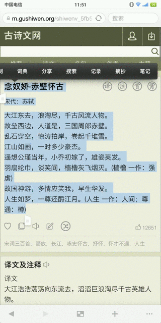

# Intent.ACTION_PROCESS_TEXT实现摘抄功能

## 一、实现效果

Android6.0以上使用`Intent.ACTION_PROCESS_TEXT`实现摘抄功能，理论上能摘抄10万字符。

`TextView`实际测试达到理论值为10万字符；

浏览器(Chrome、系统浏览器)实际测试文本长度不超过1000个字符；

测试机型：坚果Pro2，Android7.1.1



## 二、下载地址

[演示APK](https://raw.githubusercontent.com/jicanghai37927/WhatsAndroid/master/andnext_app_whatsnote/release/andnext_app_whatsnote-release.apk)

[ExtractActivity](https://github.com/jicanghai37927/WhatsAndroid/blob/master/andnext_app_whatsnote/src/main/java/com/haiyunshan/whatsnote/ExtractActivity.java)

[演示项目工程](https://github.com/jicanghai37927/WhatsAndroid)


## 三、使用方式

* 在`AndroidManifest.xml`中添加`Intent-Filter`

```xml
<activity android:name=".ExtractActivity"
          android:label="摘抄"
          android:theme="@style/AppTheme.Transparent">
    <intent-filter>
        <action android:name="android.intent.action.PROCESS_TEXT" />
        <category android:name="android.intent.category.DEFAULT" />
        <data android:mimeType="text/plain" />
    </intent-filter>
</activity>
```

* 获取数据

```java
CharSequence text = intent.getCharSequenceExtra(Intent.EXTRA_PROCESS_TEXT);
```

另外，可以通过`Intent.EXTRA_PROCESS_TEXT_READONLY`判断是否只读，非只读文本，可以通过`setResult`返回处理后的文本。


## 四、代码分析

* `Editor`

`TextView`中通过`Editor`创建了弹出菜单。

```java
private void updateAssistMenuItems(Menu menu)
    
private int createAssistMenuItemPendingIntentRequestCode()
    
private boolean shouldEnableAssistMenuItems()
    
private boolean onAssistMenuItemClicked(MenuItem assistMenuItem)

```

最终的选择文本

```java
private boolean fireIntent(Intent intent) {
    if (intent != null && Intent.ACTION_PROCESS_TEXT.equals(intent.getAction())) {
        String selectedText = mTextView.getSelectedText();
        selectedText = TextUtils.trimToParcelableSize(selectedText);
        intent.putExtra(Intent.EXTRA_PROCESS_TEXT, selectedText);
        mEditor.mPreserveSelection = true;
        mTextView.startActivityForResult(intent, TextView.PROCESS_TEXT_REQUEST_CODE);
        return true;
    }
    return false;
}
```

**理论上100K的字符数**

```java
private static final int PARCEL_SAFE_TEXT_LENGTH = 100000;

@Nullable
public static <T extends CharSequence> T trimToParcelableSize(@Nullable T text) {
    return trimToSize(text, PARCEL_SAFE_TEXT_LENGTH);
}
```


* `AppCompatTextView`、`AppCompatEditText`

`Editor`中创建的弹出菜单项，在`AppCompatTextView`和`AppCompatEditText`中被调整过，直接的结果是`MenuItem`的`groupId`从`ID_ASSIST`变成`MENU.NONE`。

```java
public class AppCompatTextView extends TextView implements TintableBackgroundView,
        AutoSizeableTextView {

	@Override
    public void setCustomSelectionActionModeCallback(ActionMode.Callback actionModeCallback) {
        super.setCustomSelectionActionModeCallback(TextViewCompat
                .wrapCustomSelectionActionModeCallback(this, actionModeCallback));
    }            
            
}
```

```java
public class AppCompatEditText extends EditText implements TintableBackgroundView {
    
    @Override
    public void setCustomSelectionActionModeCallback(ActionMode.Callback actionModeCallback) {
        super.setCustomSelectionActionModeCallback(TextViewCompat
                .wrapCustomSelectionActionModeCallback(this, actionModeCallback));
    }
    
}
```

```java
@RestrictTo(LIBRARY_GROUP)
@NonNull
public static ActionMode.Callback wrapCustomSelectionActionModeCallback(
    @NonNull final TextView textView,
    @NonNull final ActionMode.Callback callback) {
    if (Build.VERSION.SDK_INT < 26 || Build.VERSION.SDK_INT > 27
        || callback instanceof OreoCallback) {
        // If the bug does not affect the current SDK version, or if
        // the callback was already wrapped, no need to wrap it.
        return callback;
    }
    // A bug in O and O_MR1 causes a number of options for handling the ACTION_PROCESS_TEXT
    // intent after selection to not be displayed in the menu, although they should be.
    // Here we fix this, by removing the menu items created by the framework code, and
    // adding them (and the missing ones) back correctly.
    return new OreoCallback(callback, textView);
}
```

```java
// Populate the menu again with the ACTION_PROCESS_TEXT handlers.
final List<ResolveInfo> supportedActivities =
    getSupportedActivities(context, packageManager);
for (int i = 0; i < supportedActivities.size(); ++i) {
    final ResolveInfo info = supportedActivities.get(i);
    menu.add(Menu.NONE, Menu.NONE,
             MENU_ITEM_ORDER_PROCESS_TEXT_INTENT_ACTIONS_START + i,
             info.loadLabel(packageManager))
        .setIntent(createProcessTextIntentForResolveInfo(info, mTextView))
        .setShowAsAction(MenuItem.SHOW_AS_ACTION_IF_ROOM);
}
```


## 五、参考资料

http://www.jcodecraeer.com/a/anzhuokaifa/androidkaifa/2016/0116/3877.html

