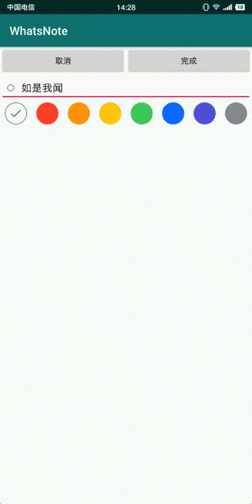

# android:tint实现颜色选择控件

## 一、实现效果



[演示APK](https://raw.githubusercontent.com/jicanghai37927/WhatsAndroid/master/andnext_app_whatsnote/release/andnext_app_whatsnote-release.apk)

[CircleColorButton.java](https://github.com/jicanghai37927/WhatsAndroid/blob/master/andnext_widget/src/main/java/club/andnext/widget/CircleColorButton.java)

[演示工程项目](https://github.com/jicanghai37927/WhatsAndroid)


## 二、使用方式

与任何一种类型的控件的使用方式完全相同。

* XML布局文件

```xml
    <club.andnext.widget.CircleColorButton
            android:id="@+id/iv_color"
            android:layout_width="12dp"
            android:layout_height="12dp"/>
```


## 三、设计目标

为**神马笔记**的标签提供颜色选择功能，要求有选中标识。


## 四、代码分析

### 1. 控件布局结构

组合2个`ImageView`实现`CircleColorButton`。`anc_iv_color`显示圆形颜色，`and_iv_check`显示选中标识。

```xml
<merge xmlns:android="http://schemas.android.com/apk/res/android"
       android:layout_width="wrap_content"
       android:layout_height="wrap_content">

    <ImageView
            android:id="@+id/anc_iv_color"
            android:layout_width="match_parent"
            android:layout_height="match_parent"
            android:layout_gravity="center"/>

    <ImageView
            android:id="@+id/anc_iv_check"
            android:layout_width="wrap_content"
            android:layout_height="wrap_content"
            android:layout_gravity="center"
            android:src="@drawable/anc_ic_check_white_24dp"/>
</merge>
```


### 2. 定义`CircleColorButton`

继承自`FrameLayout`，并实现了`Checkable`接口用于设置选中状态。

```java
public class CircleColorButton extends FrameLayout implements Checkable {
}
```


### 3. 核心属性

```java
    ImageView colorView;
    ImageView checkView;

    int replaceColor;   // color for transparent
    int color;
```


### 4. `onMeasure`保证为圆形

```java
protected void onMeasure(int widthMeasureSpec, int heightMeasureSpec) {
    super.onMeasure(widthMeasureSpec, heightMeasureSpec);

    int width = colorView.getMeasuredWidth();
    int height = colorView.getMeasuredHeight();
    if (width > 0 && height > 0 && width != height) {
        int size = (width > height)? height: width;
        width = MeasureSpec.makeMeasureSpec(size, MeasureSpec.EXACTLY);
        height = MeasureSpec.makeMeasureSpec(size, MeasureSpec.EXACTLY);

        colorView.measure(width, height);
    }
}
```


### 5. `setColor`使用`tint`进行着色

```java
public void setColor(int color) {
    this.color = color;

    if (color == Color.TRANSPARENT) {

        int c = this.getReplaceColor();

        int resId = R.drawable.anc_ic_circle_color_stroke;
        colorView.setImageResource(resId);
        colorView.setImageTintList(ColorStateList.valueOf(c));

        checkView.setImageTintList(ColorStateList.valueOf(c));

    } else {

        int c = color;

        int resId = R.drawable.anc_ic_circle_color_solid;
        colorView.setImageResource(resId);
        colorView.setImageTintList(ColorStateList.valueOf(c));

        checkView.setImageTintList(null);
    }

}
```


### 6. 透明与非透明的不同显示

* 透明色显示为圆环形状，填充色为透明，体现了透明色。

```xml
<shape xmlns:android="http://schemas.android.com/apk/res/android"
       android:shape="oval">

    <stroke android:color="#ffffff" android:width="1dp"/>

    <solid android:color="#00000000"/>

</shape>
```

* 非透明色显示为圆形，填充色为颜色自身。

```xml
<shape xmlns:android="http://schemas.android.com/apk/res/android"
        android:shape="oval">

    <solid android:color="#ffffff"/>

</shape>
```


## 五、写在最后

balabalabala……

没有了