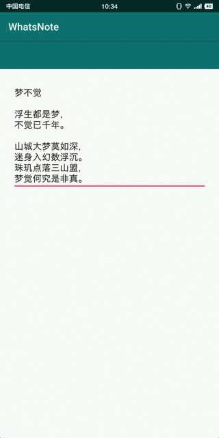

# 完美解决RecyclerView + EditText的输入问题

## 一、实现效果

* 问题描述

当EditText与RecyclerView结合使用，实现富文本编辑器，因为EditText的高度使用了WRAP_CONTENT的方式。导致用户必须点击EditText才能触发输入法。问题不大，体验不佳。理想的方式应该点击整个RecyclerView都能触发输入法。

* 实现效果

EditText的控件大小以图中红线位置为边界。顶部有24dp的Margin。并且实现用户滑动到输入法区域关闭输入法的功能。



## 二、下载地址

[演示APK](https://raw.githubusercontent.com/jicanghai37927/WhatsAndroid/master/andnext_app_whatsnote/release/andnext_app_whatsnote-release.apk)

[EditTouchHelper](https://github.com/jicanghai37927/WhatsAndroid/blob/master/andnext_recyclerview/src/main/java/club/andnext/recyclerview/helper/EditTouchHelper.java)

[演示项目工程](https://github.com/jicanghai37927/WhatsAndroid)


## 三、使用方式

1. 创建`EditTouchHelper`实例

```java
this.editTouchHelper = new EditTouchHelper();
```

2. 附加到`RecyclerView`

```java
editTouchHelper.attach(recyclerView);
```

Done. 2句代码，已经实现演示图的效果。


## 四、代码解析

之前实现过一个版本，通过继承`RecyclerView`，重载`dispatchTouchEvent`方法的方式实现。使用继承方式过于暴力，非常不优雅。

当前版本的实现通过`OnItemTouchListener`，动态添加到`RecyclerView`的方式实现，比前个版本优雅许多。

###  1. 实现`RecyclerView.OnItemTouchListener`接口

实现该接口来处理Touch事件。

```java
public class EditTouchHelper implements RecyclerView.OnItemTouchListener {
}
```

### 2. 重载`onInterceptTouchEvent`方法

在该方法中，判断Touch事件是否传入到RecyclerView的子控件中，如果没有，则寻找EditText子控件，并将事件传给EditText。

```java
int action = e.getActionMasked();
switch (action) {
    case MotionEvent.ACTION_DOWN: {
        this.target = findTarget(rv, e);
        if (target != null) {
            rect = getRect(rv, target);
        }

        break;
    }
}
```

### 3. 判断Touch事件下是否有子控件

这里将X坐标调整到RecyclerView的中间，为确保子控件设置了左右Margin时，`findChildViewUnder()`方法返回`null`的问题。（更好的解决方案或许是重新写个方法。）如果`findChildViewUnder()`返回`null`则使用最后一个子控件或者第一个子控件。

```java
float x = rv.getWidth() / 2;
float y = e.getY();

View view = rv.findChildViewUnder(x, y);
if (view == null) {
    while (rv.getChildCount() != 0) {

        // try last one
        {
            view = rv.getChildAt(rv.getChildCount() - 1);
            rect = getRect(rv, view);
            if (y > rect.bottom) {
                break;
            }
        }

        // try first one
        {
            view = rv.getChildAt(0);
            rect = getRect(rv, view);
            if (y < rect.top) {
                break;
            }
        }

        // remain null
        {
            view = null;
            break;
        }
    }
}
```

### 4. 查找EditText

这里查找的是TextView，当TextView`isTextSelectable`时，认为可交互的，应该使之可以弹出选择菜单。

```java
TextView findTextView(View child) {
    if (child.getVisibility() != View.VISIBLE) {
        return null;
    }

    if (!child.isEnabled()) {
        return null;
    }

    if (child instanceof EditText) {
        return (EditText)child;
    }

    if (child instanceof TextView) {
        TextView view = (TextView)child;
        if (view.onCheckIsTextEditor()) {
            return view;
        }

        if (view.isTextSelectable()) {
            return view;
        }

        return null;
    }

    if (child instanceof ViewGroup) {
        ViewGroup layout = (ViewGroup)child;
        for (int i = 0, size = layout.getChildCount(); i < size; i++) {
            TextView view = findTextView(layout.getChildAt(i));
            if (view != null) {
                return view;
            }
        }
    }

    return null;
}
```

### 5. 调整坐标，传递给EditText

创建相对于EditText的坐标。

```java
MotionEvent obtain(MotionEvent e) {
    MotionEvent event = MotionEvent.obtain(e);
    float x = e.getX();
    if (x < rect.left) {
        x = 0;
    } else if (x > rect.right) {
        x = target.getWidth();
    } else {
        x = (x - rect.left);
    }

    float y = e.getY();
    if (y < rect.top) {
        y = 0;
    } else if (y > rect.bottom) {
        y = target.getHeight();
    } else {
        y = (y - rect.top);
    }

    event.setLocation(x, y);

    return event;
}
```

```java
if (target != null) {
    MotionEvent event = this.obtain(e);
    target.dispatchTouchEvent(event);
    event.recycle();
}
```


## 五、遗留问题

这里假定了RecyclerView中可交互的控件只有EditText，并且所有子控件没有上下Margin。

前者导致出现其他可交互的控件如Button时，可能导致无法响应问题。

后者导致在2个子控件Margin区域，无法触发输入法问题。


目前**神马笔记**的编辑器只有一个EditText，所以完美解决了问题。