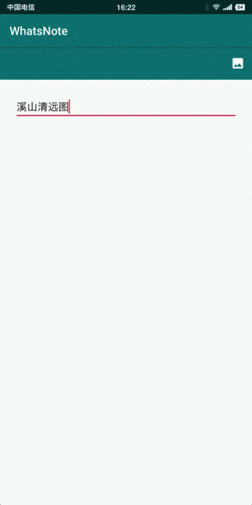

# RecyclerView实现图文混排

## 一、实现效果



**WhatsNote**项目地址：https://github.com/jicanghai37927/WhatsAndroid


## 二、设计思路

* 实现图片混排的几种方案

1. `TextView`通过`ImageSpan`添加图片； 
2. `WebView`加载网页方式；
3. `ScrollView`、`RecyclerView`等布局控件组合`TextView`、`ImageView`；

**WhatsNote**采用的`RecyclerView`组合`TextView`、`ImageView`的方式，这种方式的限制是文字与图片只能按照固定的并排方式出现，无法实现图片环绕等效果。图片环绕需要通过`TextView`的`Span`来实现。

* 图文混排实现过程

1. `Intent.ACTION_PICK`选择图片；
2. `Glide`加载图片；
3. `ImageView`显示图片；

三个过程完成添加图片功能。


## 三、实现过程

### 1. 选择图片

图片选择采用Intent调用第三方Activity的方式实现，并且允许选择多张图片。

```java
boolean requestPhoto() {
    SoftInputUtils.hide(getActivity());

    Intent intent = new Intent(Intent.ACTION_PICK, null);
    intent.setDataAndType(
        MediaStore.Images.Media.EXTERNAL_CONTENT_URI,
        "image/*");
    intent.putExtra(Intent.EXTRA_ALLOW_MULTIPLE, true);

    try {
        this.startActivityForResult(intent, REQUEST_PHOTO);

        return true;
    } catch (Exception e) {

    }

    return false;
}
```

在`onActivityResult`中处理返回结果。

```java
if ((resultCode == RESULT_OK) && (data != null)) {

    ArrayList<Uri> list = new ArrayList<>();

    {
        ClipData clipData = data.getClipData();
        if (clipData != null) {
            for (int i = 0; i < clipData.getItemCount(); i++) {
                ClipData.Item item = clipData.getItemAt(i);
                Uri uri = item.getUri();
                list.add(uri);
            }
        }

        if (list.isEmpty()) {
            Uri uri = data.getData();
            if (uri != null) {
                list.add(uri);
            }
        }
    }

    this.insertPhotos(list);

}
```


### 2. 加载图片

图片加载使用`Glide`实现，整个过程非常简单。`with`，`load`，`apply`，`into`4个方法完成加载过程。

```java
RequestOptions options = createRequestOptions(item);
Glide.with(parent)
    .load(item.getUri())
    .apply(options)
    .into(pictureView);
```

```java
RequestOptions createRequestOptions(PictureEntity entity) {
    RequestOptions options = new RequestOptions();

    int maxWidth = this.getMaxWidth();
    int maxHeight = 3 * this.getMaxHeight();

    int width = maxWidth;
    int height = width * entity.getHeight() / entity.getWidth();
    if (height > maxHeight) {
        height = maxHeight;
        width = height * entity.getWidth() / entity.getHeight();

        width = (width > maxWidth)? maxWidth: width;
    }

    options.override(width, height);
    options.downsample(DownsampleStrategy.FIT_CENTER);
    options.signature(new ObjectKey(entity.getSignature()));

    return options;
}
```

重要的`apply`方法，指定了三个参数。

* override图片大小（宽度不大于屏幕宽度，高度不大于3倍屏幕高度，降低OutOfMemory出现概率）
* downsample取样模式（采用FIT_CENTER方式，居中缩放）
* signature签名


### 3. 显示图片

使用`TargetSizeImageView`显示图片，`TargetSizeImageView`是`ImageView`的子类，通过指定目标尺寸决定控件大小。

```java
@Override
protected void onMeasure(int widthMeasureSpec, int heightMeasureSpec) {
    if (targetWidth <= 0 || targetHeight <= 0) {
        super.onMeasure(widthMeasureSpec, heightMeasureSpec);

        return;
    }

    int measureWidth = MeasureSpec.getSize(widthMeasureSpec);
    int measureHeight = MeasureSpec.getSize(heightMeasureSpec);

    if (measureWidth <= 0) {
        super.onMeasure(widthMeasureSpec, heightMeasureSpec);
        return;
    }

    Log.v(TAG, "onMeasure width = " + measureWidth + ", height = " + measureHeight);

    int minWidth = this.getSuggestedMinimumWidth();
    int minHeight = this.getSuggestedMinimumHeight();

    int width = targetWidth;
    width = (width > measureWidth)? measureWidth : width; // width must not large then measureWidth
    width = (width < minWidth)? minWidth: width; // and not smaller then minWidth

    int height = width * targetHeight / targetWidth; // calculate height from width
    if (height < minHeight) { // recalculate width
        height = minHeight;
        width = height * targetWidth / targetHeight;

        width = (width > targetWidth)? targetWidth: width;
        width = (width > measureWidth)? measureWidth : width; // width must not large then measureWidth
        width = (width < minWidth)? minWidth: width; // and not smaller then minWidth
    }

    Log.v(TAG, "width = " + width + ", height = " + height);
    this.setMeasuredDimension(width, height);
}
```

`TargetSizeImageView`控件大小计算过程

* targetWidth（指定的目标宽度）
* measureWidth（传入的测量宽度）
* minWidth（最小宽度）保证小图的显示尺寸

```java
int width = targetWidth; // 等于targetWidth
width = (width > measureWidth)? measureWidth : width; // 但不能大于measureWidth
width = (width < minWidth)? minWidth: width; // 并且不能小于minWidth
```

宽度确定后，根据`targetWidth`和`targetHeight`的比例计算高度。

```java
int height = width * targetHeight / targetWidth; // 按比例计算高度
```

同时保证高度不小于最小高度。

```java
if (height < minHeight) { // recalculate width
    height = minHeight;
    width = height * targetWidth / targetHeight;

    width = (width > targetWidth)? targetWidth: width;
    width = (width > measureWidth)? measureWidth : width; 
    width = (width < minWidth)? minWidth: width; 
}
```


## 四、最后

到这里，我们实现了CRUD的Create和Read两个环节。

Update和Delete将在后续过程中实现。

