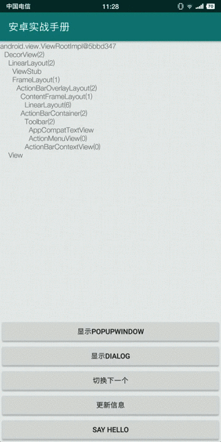
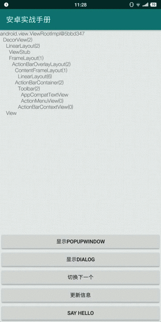

# PopupWindow与Dialog的区别

效果上，两者都可以实现弹出界面。本质上有什么区别呢？

## 一、结论

* `PopupWindow`为非模态，可以继续操作弹出界面之下的控件；
* `Dialog`为模态，必须先取消Dialog才能操作Dialog之下的控件；

## 二、`PopupWindow`与`Dialog`差异演示

* PopupWindow操作效果

弹出PopupWindow后，点击“Say Hello“按钮，PopupWindow消失的同时，出现Toast。

说明PopupWindow为非模态。




* Dialog操作效果

弹出Dialog后，点击"Say Hello"按钮，Dialog消失。再次点击"Say Hello"按钮，出现Toast。

说明Dialog为模态。




## 三、`PopupWindow`与`Dialog`的代码实现

### 1. 内部实现

`PopupWindow`将`PopuDecorView`添加到`Context`的`Windowmanager`。`PopupDecorView`继承自`FrameLayout`。

```java
private class PopupDecorView extends FrameLayout {
}
```

```java
private void invokePopup(WindowManager.LayoutParams p) {
        if (mContext != null) {
            p.packageName = mContext.getPackageName();
        }

        final PopupDecorView decorView = mDecorView;
        decorView.setFitsSystemWindows(mLayoutInsetDecor);

        setLayoutDirectionFromAnchor();

        mWindowManager.addView(decorView, p);

        if (mEnterTransition != null) {
            decorView.requestEnterTransition(mEnterTransition);
        }
    }
```

`Dialog`创建了`PhoneWindow`，将`PhoneWindow`的`DecorView`添加到`Context`的`WindowManager`。

```java
private Activity mOwnerActivity;

private final WindowManager mWindowManager;

final Context mContext;
final Window mWindow;

View mDecor;

private ActionBar mActionBar;
```

```java
final Window w = new PhoneWindow(mContext);
mWindow = w;
w.setCallback(this);
w.setOnWindowDismissedCallback(this);
w.setOnWindowSwipeDismissedCallback(() -> {
    if (mCancelable) {
        cancel();
    }
});
w.setWindowManager(mWindowManager, null, null);
w.setGravity(Gravity.CENTER);
```

```java
mDecor = mWindow.getDecorView();

if (mActionBar == null && mWindow.hasFeature(Window.FEATURE_ACTION_BAR)) {
    final ApplicationInfo info = mContext.getApplicationInfo();
    mWindow.setDefaultIcon(info.icon);
    mWindow.setDefaultLogo(info.logo);
    mActionBar = new WindowDecorActionBar(this);
}

WindowManager.LayoutParams l = mWindow.getAttributes();
boolean restoreSoftInputMode = false;
if ((l.softInputMode
                & WindowManager.LayoutParams.SOFT_INPUT_IS_FORWARD_NAVIGATION) == 0) {
            l.softInputMode |=
                    WindowManager.LayoutParams.SOFT_INPUT_IS_FORWARD_NAVIGATION;
            restoreSoftInputMode = true;
        }

mWindowManager.addView(mDecor, l);
```


### 2. 所处的包位置package

`PopupWindow`属于`android.widget`，与`Button`，`TextView`，`LinearLayout`等控件属于同一个package。

```java
package android.widget;
	PopupWindow
	Button
	TextView
	LinearLayout
	……
```

`Dialog`属于`android.app`，与`Activity`属于同一个Package。

```java
package android.app;
	Dialog
	Activity
	……
```

### 3. 类定义及继承关系

`PopupWindow`继承自`Object`，并且没有实现任何接口。

```java
public class PopupWindow {
}
```

`Dialog`继承自`Object`，实现了`Window.Callback`，`Window.OnWindowDismissedCallback`等接口。

```java
public class Dialog implements 
    DialogInterface, 
	Window.Callback,
	KeyEvent.Callback, 
	OnCreateContextMenuListener, 
	Window.OnWindowDismissedCallback {
        
}
```

`Activity`的类定义。

```java
public class Activity extends ContextThemeWrapper implements 
    LayoutInflater.Factory2,
	Window.Callback, 
	KeyEvent.Callback,
	OnCreateContextMenuListener, 
	ComponentCallbacks2,
	Window.OnWindowDismissedCallback, 
	WindowControllerCallback,
	AutofillManager.AutofillClient {
}
```


## 四、如何选择？

优先选择使用Dialog，方便、快速。

需要非模态弹出界面时，使用PopupWindow。

另外PopupWindow提供了定位界面位置的方法，需要设定位置时，考虑使用PopupWindow。

