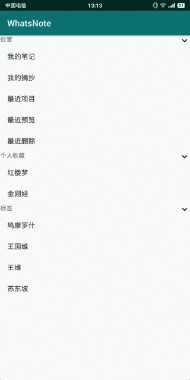

# 基于RecyclerView的分组列表

## 一、实现效果



[演示APK](https://raw.githubusercontent.com/jicanghai37927/WhatsAndroid/master/andnext_app_whatsnote/release/andnext_app_whatsnote-release.apk)

[SectionList.java](https://github.com/jicanghai37927/WhatsAndroid/blob/master/andnext_recyclerview/src/main/java/club/andnext/recyclerview/section/SectionList.java)

[演示工程项目](https://github.com/jicanghai37927/WhatsAndroid)


## 二、使用方式

### 1. 创建SectionList实例

必须传入`SectionListAdapterCallback`实例，当`SectionList`内部发生变化时（展开、折叠、……）通知`adapter`。

```java
this.sectionList = new SectionList(new SectionListAdapterCallback(adapter));
```


### 2. 添加分组

添加分组数据由3个部分组成。

* `Object userObject`分组自身的数据
* `boolean expand`初始状态，展开或者折叠
* `ClazzAdapterProvider provider`分组数据提供者，获取分组下的子数据

```java
sectionList.add(entranceSection, true, entranceSection);
sectionList.add(favoriteSection, true, favoriteSection);
sectionList.add(tagSection, true, tagSection);
```


### 3. 数据关联到Adapter

这里使用了二次封装的Adapter，简化了`RecyclerView.Adapter`的使用。

```java
this.adapter = new BridgeAdapter(getActivity(), new SectionListProvider());
```

```
private class SectionListProvider implements BridgeAdapterProvider {

    @Override
    public Object get(int position) {
    return sectionList.get(position);
    }

    @Override
    public int size() {
    return sectionList.size();
    }
    
}
```


## 三、设计思路

与《[基于RecyclerView的树形结构](https://blog.csdn.net/chuyangchangxi/article/details/83376084)》同样的设计思路，没有提供特定的数据结构。只需要将数据迁移到`SectionList`，并且实现`ClazzAdapterProvider`接口，提供分组的子数据，完全不需要改动`ViewHolder`，调整部分`Adapter`代码，即可实现分组列表功能。


## 四、代码分析

### 1. 核心属性

```java
ArrayList<Section> list; // 分组数据

SectionList.Callback callback; // 回调接口
```


### 2. Section分组类

保存分组的数据以及折叠/展开状态。

```java
private static class Section {

    boolean expand;

    Object userObject;
    ClazzAdapterProvider provider;

    public Section(Object userObject, boolean expand, ClazzAdapterProvider provider) {
        this.expand = expand;

        this.userObject = userObject;
        this.provider = provider; 
    }

    public Object getUserObject() {
        return userObject;
    }

    void setExpand(boolean value) {
        if (!(expand ^ value)) {
            return;
        }

        this.expand = value;
    }

    boolean isExpand() {
        return expand;
    }

    Object get(int index) {
        return provider.get(index);
    }

    int size() {
        return provider.size();
    }

}
```

### 3. 获取列表数据

与`TreeList`不同，没有将数据保存到列表中，而是采用遍历Section的方式获取数据。

```java
public Object get(int position) {
    Object obj = null;

    for (Section s : list) {
        if (position == 0) {
            obj = s.getUserObject();
            break;
        }

        position -= 1;
        if (s.isExpand() && position < s.size()) {
            obj = s.get(position);
            break;
        }

        if (s.isExpand()) {
            position -= s.size();
        }
    }

    return obj;
}
```


### 4. 获取总数

同样采用遍历`Section`的方式来获取。

```java
public int size() {
    int size = 0;
    for (Section s : list) {
        size += 1;

        if (s.isExpand()) {
            size += s.size();
        }
    }

    return size;
}
```


### 5. balabalabala……

代码很简单，懒得写了，自己看：）

[SectionList.java](https://github.com/jicanghai37927/WhatsAndroid/blob/master/andnext_recyclerview/src/main/java/club/andnext/recyclerview/section/SectionList.java)

