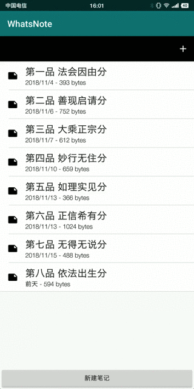

# SortedList实现RecyclerView排序

## 一、实现效果



[演示APK](https://raw.githubusercontent.com/jicanghai37927/WhatsAndroid/master/andnext_app_whatsnote/release/andnext_app_whatsnote-release.apk)

[RecordListFragment.java](https://github.com/jicanghai37927/WhatsAndroid/blob/master/andnext_app_whatsnote/src/main/java/com/haiyunshan/whatsnote/record/RecordListFragment.java)

[演示项目工程](https://github.com/jicanghai37927/WhatsAndroid)


## 二、功能设计

支持5种排序方式

* 名称
* 创建时间
* 修改时间（修改时间仅在**最近项目**中使用，其他列表位置按照创建时间排序）
* 大小
* 标签

同时支持升序和降序排列，通过再次选择相同的排序方式实现切换。

另外添加记录时，按照排序方式插入到相应的位置。


## 三、SortedList

用于实现`RecyclerView`的排序功能。

### 1. 构造函数

```java
public SortedList(@NonNull Class<T> klass, 
                  @NonNull Callback<T> callback, 
                  int initialCapacity) {
}
```

必须为`SortedList`指定Item类型，以及Callback用于通知`Adapter`变化情况。

### 2. SortedList.Callback

```java
public static abstract class Callback<T2> implements Comparator<T2>, ListUpdateCallback {
}
```

`Callback`由3个部分组成

1. `Comparator`对Item进行排序
2. `ListUpdateCallback`通知`Adapter`变化情况
3. `Callback`自身的接口定义

### 3. SortedList.Callback关键接口

```java
/**
 * 继承自Comparator，实现Item排序
 */
abstract public int compare(T2 o1, T2 o2);

/**
 * 判断2个Item的内容是否一致，内容不同则通知Adapter#onChanged
 */
abstract public boolean areContentsTheSame(T2 oldItem, T2 newItem);

/**
 * 判断是否是相同的Item，从数据库中读取数据会创建不同的实例，当ID一致时，其实是相同数据的2个实例。
 * 此时通过该方式可以确定是否为同一数据。
 */
abstract public boolean areItemsTheSame(T2 item1, T2 item2);
```


## 四、实现过程

### 1. compare

根据不同类型创建相应的Comparator进行比较。

```java
@Override
public int compare(RecordEntity o1, RecordEntity o2) {

    int result = sortEntity.getComparator().compare(o1, o2);

    return result;
}
```

```java
comparatorFactory = new ComparatorFactory();

comparatorFactory.register(SortEntity.ID_NAME,      ComparatorFactory.Name.class);
comparatorFactory.register(SortEntity.ID_CREATED,   ComparatorFactory.Created.class);
comparatorFactory.register(SortEntity.ID_MODIFIED,  ComparatorFactory.Modified.class);
comparatorFactory.register(SortEntity.ID_SIZE,      ComparatorFactory.Size.class);
comparatorFactory.register(SortEntity.ID_TAG,       ComparatorFactory.Tag.class);

```

### 2. areContentsTheSame

重载`equals`对`RecordEntity`内容进行比较。

依次比较名称、大小、创建时间、修改时间。

其中修改时间以分钟作为比较单位。

```java
@Override
public boolean areContentsTheSame(RecordEntity oldItem, RecordEntity newItem) {
    return oldItem.equals(newItem);
}

```

```java
public boolean equals(@Nullable Object obj) {
    if (obj == null) {
        return false;
    }

    if (!(obj instanceof RecordEntity)) {
        return false;
    }

    boolean result = true;
    RecordEntity another = (RecordEntity)obj;

    if (result) {
        result = this.getName().equals(another.getName());
    }

    if (result) {
        result = this.getSize() == another.getSize();
    }

    if (result) {
        result = this.getCreated().equals(another.getCreated());
    }

    if (result) {
        result = (Minutes.minutesBetween(this.getModified(), another.getModified()).getMinutes() == 0);
    }

    return result;
}
```

### 3. areItemsTheSame

根据`RecordEntity`的`ID`进行判断，相同的`ID`为同一数据。

```java
@Override
public boolean areItemsTheSame(RecordEntity item1, RecordEntity item2) {
    return item1.getId().equals(item2.getId());
}
```


## 五、写在最后

`SortedList`简单易用。

更多内容查看[RecordListFragment.java](https://github.com/jicanghai37927/WhatsAndroid/blob/master/andnext_app_whatsnote/src/main/java/com/haiyunshan/whatsnote/record/RecordListFragment.java)


