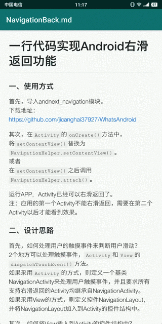

# Android渲染markdown文件

## 一、使用方式Usage

- 实现效果




- 下载android_marked模块

下载地址：https://github.com/jicanghai37927/WhatsAndroid/tree/master/andnext_marked


- 创建MarkedWebView控件

```xml
    <club.andnext.marked.MarkedWebView
            android:id="@+id/marked_view"
            android:layout_width="match_parent"
            android:layout_height="match_parent">
```


- 设置Markdown内容

```Java
markedWebView.setText(text);
```


## 二、代码解析

- 代码结构

```Java
package club.andnext.marked;
	MarkedWebView.java
```

* 资源结构

```Java
assets
	AndroidMarked.html // WebView预加载页面，负责渲染markdown文件
	marked.0.5 // 使用marked解析markdown
    github-markdown-css.2.10.0 // css样式
    highlightjs.9.13.1 // 代码高亮
```

- `MarkedWebView.java`

MarkedWebView继承自WebView，并且预先加载了`AndroidMarked.html`文件用以渲染markdown内容。

- `AndroidMarked.html`

AndroidMarked.html有三个部分组成：  

1. `marked.js` 解析markdown内容，生成html内容；
2. `markdown.css` markdown的样式css，决定最终显示效果，使用的是GitHub样式；
3. `highlight.js` 代码语法高亮；


## 三、参考资料

* marked.js https://marked.js.org/
* github-markdown-css https://github.com/sindresorhus/github-markdown-css
* highlight.js https://highlightjs.org/


